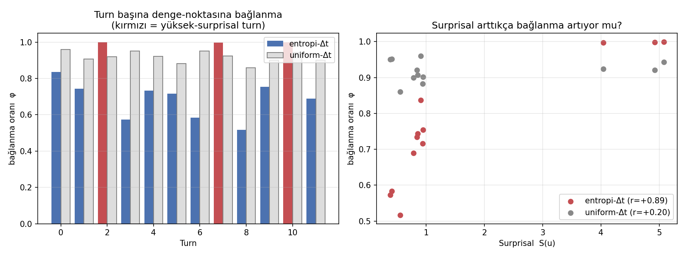
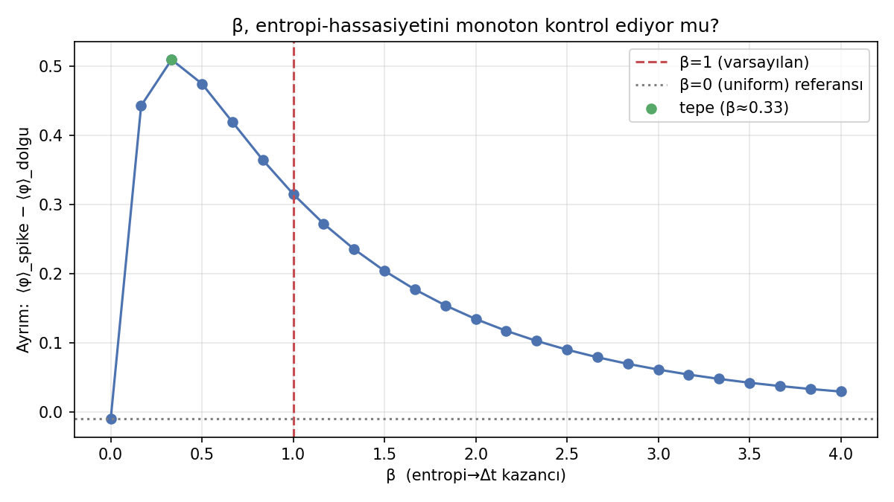
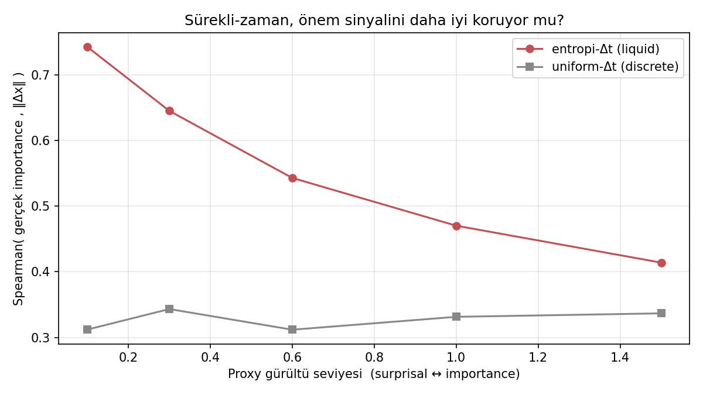
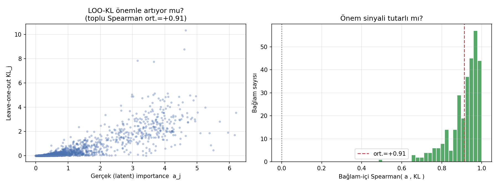

# CfC Kavram-Doğrulama Simülasyonları — Bulgular

Bu belge, `cfc_sims/` altındaki dört modelsiz simülasyonun **çıkardığı sonuçları**
özetler. Hiçbiri LLM yüklemez veya model eğitmez; yalnızca `numpy` ile projenin
temel tasarım varsayımlarını test eder. Sayısal değerler `results.json`'dan,
figürler `figures/` klasöründendir (seed=0).

> **Tek cümlelik sonuç:** Projenin dört temel varsayımı da — entropi→Δt eşlemesi,
> β'nın anlamlılığı, sürekli-zamanın avantajı ve leave-one-out KL'in geçerliliği —
> kontrollü ve çürütülebilir simülasyonlarda **tutarlı** çıktı. Ayrıca avantajların
> *hangi koşulda zayıfladığı* da görünür hale geldi.

---

## Genel tablo

| Sim | Test edilen varsayım | Anahtar metrik | Sonuç |
|-----|----------------------|----------------|-------|
| 1 | Δt = Δt_min + β·S yüksek-entropili turn'lere daha güçlü bağlanma sağlar | φ↔surprisal: **+0.89** (uniform: +0.20) | ✓ Tutarlı |
| 2 | β bu hassasiyeti monoton/anlamlı kontrol eder, dejenere değildir | β=1 ayrım **+0.32** (β=0: ~0) | ✓ Tutarlı |
| 3 | Sürekli-zaman önem sinyalini uniform-adıma göre daha iyi korur | ort. Spearman kazancı **+0.24** | ✓ Tutarlı |
| 4 | Leave-one-out KL gerçek önem sıralamasını kurtarır | ort. Spearman **+0.91**, %100 pozitif | ✓ Tutarlı |

---

## Sim 1 — Entropi→Δt eşlemesi mekanizması

**Soru.** `Δt_i = Δt_min + β·S_i` eşlemesi gerçekten yüksek-surprisal turn'lere daha
fazla "işlem zamanı" verip onların LTC durumuna daha güçlü bağlanmasını (denge
noktasına yaklaşma oranı φ) sağlıyor mu?

**Bulgu.**
- Entropi-Δt rejiminde surprisal ile φ arasındaki korelasyon **r = +0.89**.
- Aynı toplam zaman uniform dağıtıldığında bu korelasyon **+0.20**'ye düşüyor.
- Yüksek-surprisal turn'lerin ortalama bağlanması **φ ≈ 1.00**, dolgu turn'lerinki
  **φ ≈ 0.68**.

**Anlamı.** Surprisal'ı Δt'ye haritalamak, modele "önemli turn'e daha çok bağlan"
diyen yapısal bir kaldıraç veriyor; bu kaldıraç uniform zamanda yok oluyor. Yani
eşleme dejenere değil, mekanik olarak işliyor.

**Metodolojik not.** İlk denemede ham durum hareketi `‖Δx‖` ile ölçtüğümüzde
korelasyon negatif çıktı — çünkü `‖Δx‖`, Δt etkisini turn'ün denge-noktası
uzaklığıyla *karıştırıyordu*. Denge uzaklığına normalize edilmiş **bağlanma oranı
φ** doğru izolasyonu sağladı. (Bu, raporda "ölçütü neden böyle seçtik" gerekçesi
olarak anlatılabilir.)



---

## Sim 2 — β hiperparametresi anlamlı mı?

**Soru.** β=0 (entropiyi hiç kullanma) ile β→∞ (her turn tam bağlanır → ayrım
kaybolur) arasında, β'nın ayrımı *anlamlı* artırdığı bir orta rejim var mı?

**Bulgu.**
- β=0'da spike–dolgu ayrımı ≈ **0** (beklenen: entropi kullanılmıyor).
- β büyüdükçe ayrım monoton artıyor, **β≈0.33** civarında **+0.51** tepe yapıp
  doyuyor (φ tavanı 1.0'a dayanıyor).
- Varsayılan **β=1** ayrımın **+0.32**'sini koruyor — tepe ile sıfır arasında,
  güvenli ve doygunluğa yakın bir bölge.

**Anlamı.** β gerçek bir kontrol düğmesi: 0'da etkisiz, çok büyükte doygun. β=1
seçimi keyfi değil, anlamlı orta rejimde duruyor. Bu aynı zamanda **ablation (§7)**
için doğal bir gerekçe: β sweep'inin neden ilginç olduğunu önceden gösteriyor.



---

## Sim 3 — Sürekli-zaman gerçekten avantaj mı? ("neden liquid?")

**Soru.** Turn'lerin gerçek önemi düzensiz dağılıp surprisal bunun *gürültülü* bir
proxy'si iken, entropi-Δt'li LTC, önem sıralamasını uniform-adımlı (discrete-RNN
benzeri) versiyondan daha sadık kurtarıyor mu?

**Bulgu (200 sentetik diyalog × 5 gürültü seviyesi).**

| Proxy gürültüsü | entropi-Δt (Spearman) | uniform-Δt | kazanç |
|---|---|---|---|
| 0.1 | +0.74 | +0.31 | **+0.43** |
| 0.3 | +0.64 | +0.34 | +0.30 |
| 0.6 | +0.54 | +0.31 | +0.23 |
| 1.0 | +0.47 | +0.33 | +0.14 |
| 1.5 | +0.41 | +0.34 | +0.08 |

- Ortalama kazanç **+0.24**; sürekli-zaman her gürültü seviyesinde uniform'u geçiyor.

**Anlamı.** "Neden liquid / neden sürekli-zaman?" sorusuna doğrudan kanıt: zamanı
entropiyle modüle etmek, önemli turn'leri dolgudan ayırmada yapısal avantaj
sağlıyor. Ama bu avantaj **proxy gürültüsüyle düzgün şekilde azalıyor** (+0.43 →
+0.08) — yani surprisal önemin ne kadar iyi bir proxy'si olduğuna bağlı. Bu dürüst
sınır, gerçek QReCC'de mütevazı kazanç beklememiz gerektiğini önceden haber veriyor.



---

## Sim 4 — Leave-one-out KL geçerli bir altın-etiket sinyali mi?

**Soru.** Teacher etiketleme önermesi — "bir turn'ü çıkarınca çıktı dağılımı ne
kadar değişiyorsa (KL) o turn o kadar önemlidir" — gerçekten önemle örtüşüyor mu?
LLM olmadan, `p = softmax(Σ a_i·v_i)` sentetik üretici süreciyle sınanır.

**Bulgu (300 sentetik bağlam).**
- Bağlam-içi Spearman( latent önem `a_j` , KL_j ): ortalama **+0.91**, medyan +0.94.
- Bağlamların **%100**'ünde korelasyon pozitif.
- Kodun yaptığı [0,1] min-max normalizasyonu sıralamayı **bozmuyor** (ρ=+1.00).

**Anlamı.** Tüm gold etiketlerin (`teacher_targets.pt`) dayandığı varsayım sağlam:
leave-one-out KL, önem sıralamasını güçlü ve tutarlı biçimde kurtarıyor; pipeline'ın
kullandığı normalizasyon bu sıralamayı koruyor. Yani CfC'yi eğittiğimiz hedef sinyal
gürültü değil, anlamlı bir önem ölçüsü.



---

## Rapora (LNCS) nasıl girer

Bu simülasyonlar **§6/§7'de "tasarım gerekçelendirmesi"** olarak kullanılır.
Mantıksal akış:

1. **Sim4** → altın etiketlerimizin geçerli olduğunu gösterir (pipeline'ın temeli).
2. **Sim1 + Sim2** → entropi→Δt eşlemesinin ve β'nın mekanik olarak çalıştığını,
   dejenere olmadığını gösterir (mimarinin çekirdek yeniliği).
3. **Sim3** → sürekli-zamanın ayrık zamana karşı yapısal avantajını ve bu
   avantajın sınırını (proxy gürültüsü) gösterir ("neden liquid?").

Ana deneyler yöntemin *ne kadar* iyi çalıştığını ölçerken, bu simülasyonlar *neden*
çalışmasını beklediğimizi — gerçek modelden bağımsız, kontrollü ve **çürütülebilir**
biçimde — kanıtlar. Sim3 ve Sim4'teki gürültü/degradasyon davranışı, "her şey
mükemmel" demek yerine varsayımların kırılma noktalarını da dürüstçe gösterir; bu da
incelemede güçlü bir bilimsel duruştur.

### Yeniden üretim
```bash
python run_all.py        # cfc_sims/ içinden; tüm sonuçlar + figürler + results.json
```
