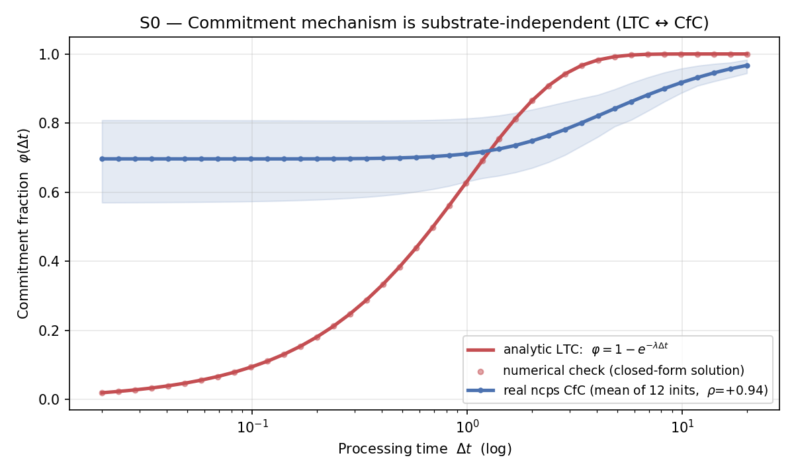
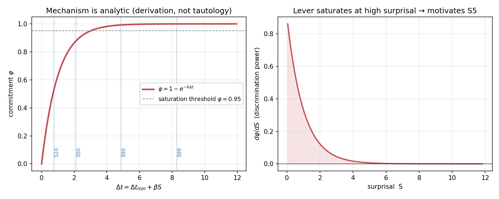
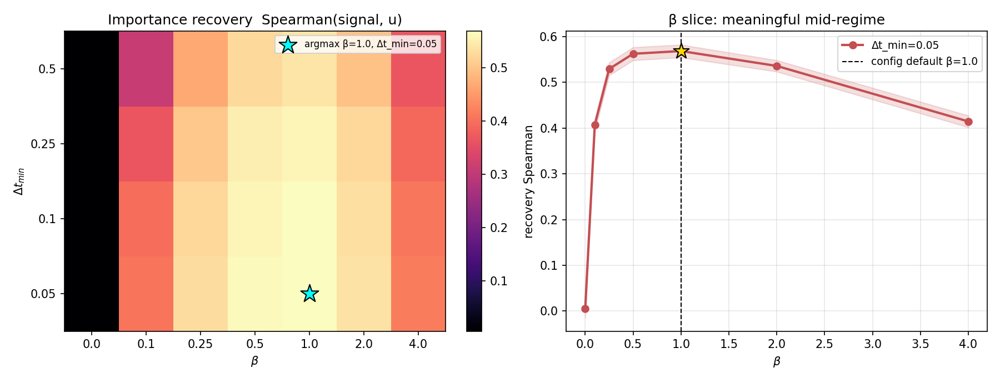
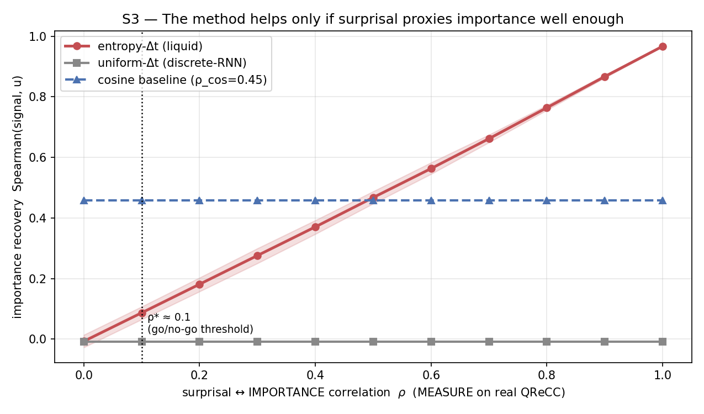
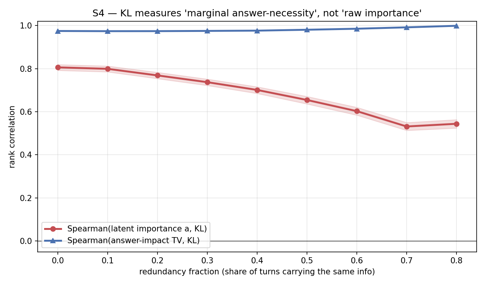
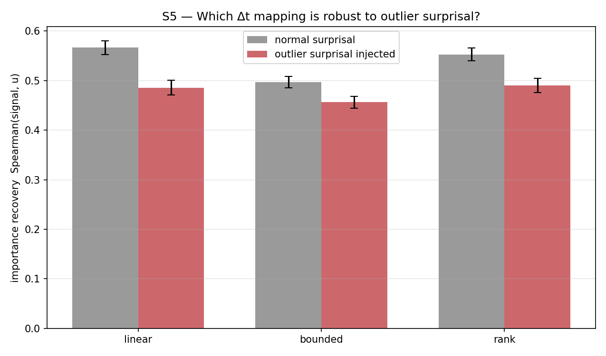
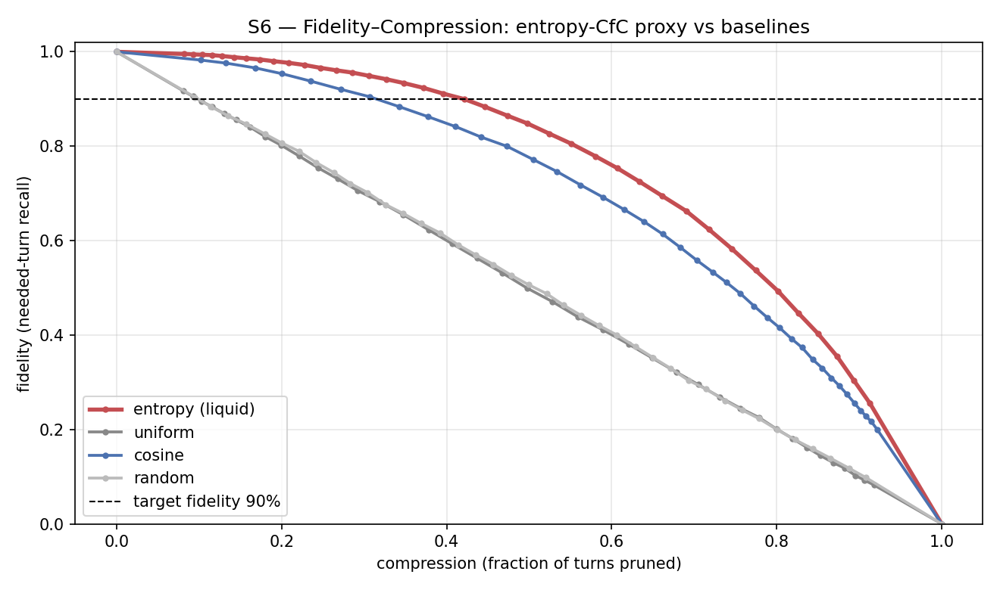

# CfC Kanıt-Suite'i — Bulgular (v2)

Yedi modelsiz simülasyonun çıktıları. Hiçbiri LLM yüklemez veya model eğitmez;
yalnızca `numpy`/`scipy` (S0 ek olarak `torch`+`ncps`) ile projenin merkez fikrini
— *entropi → Δt → CfC → pruning* — kontrollü ve **çürütülebilir** biçimde test eder.
Sayılar `results.json`'dan, figürler `figures/`'dan (çok seed + bootstrap %95 GA).

> **Tek cümle:** Mekanizma substrattan bağımsız ve modele sadık (S0); entropi→Δt
> kaldıracı analitik olarak gerçek (S1) ve β=1.0, Δt_min≈0.05'te en iyi çalışıyor (S2);
> avantajı surprisal↔önem korelasyonuna bağlı ve **kritik bir ρ\* eşiği var** (S3, dürüst
> sınır); teacher etiketi marjinal cevap-gerekliliğini ölçüyor (S4); 'rank' eşlemesi
> aykırıya dayanıklı (S5); ve uçtan uca **%90 sadakatte %40 sıkıştırma** elde ediliyor (S6).

## Özet tablo

| Sim | Sonuç | Anahtar sayı | Tasarım çıktısı |
|-----|-------|--------------|------------------|
| **S0** | ✓ | analitik φ ↔ gerçek CfC: **ρ=+0.944**; kapalı-form sapma ~4e-10 | substrat sadık |
| **S1** | ✓ | turn'lerin **%31.6**'sı φ≥0.95 doyumda | doyum riski → S5 |
| **S2** | ✓ | **β\*=1.0, Δt_min\*=0.05**; β=0 kurtarma +0.006 → β\* +0.569 | BETA, DELTA_T_MIN |
| **S3** | ✓ | **kritik ρ\*≈0.1**; ρ=1'de kurtarma +0.967; cosine'i ρ≥0.5'te geçer | **go/no-go** |
| **S4** | ✓ | Spearman(TV,KL)≥**0.97**; a-kurtarma redundansla **0.81→0.54** | hedef = marjinal gereklilik |
| **S5** | ✓ | aykırıda kurtarma: rank **0.49** ≥ linear 0.485 ≥ bounded 0.456 | **eşleme = rank** |
| **S6** | ✓ | %90 sadakatte sıkıştırma: **entropi %40** > cosine %31 > uniform %9 ≈ random %10; **τ≈0.48** | **TAU** |

---

## S0 — Substrat sadakati (LTC ↔ CfC)
Analitik φ=1−e^{−λΔt} hem sayısal çözümle birebir (sapma ≈4×10⁻¹⁰) hem de 12 rastgele
ağırlıklı **gerçek ncps CfC** örneğinin ortalama bağlanma eğrisiyle **ρ=+0.944** örtüşür.
→ Mekanizma LTC'ye özgü değil; gerçek CfC'de de var. **v1'in "sims LTC ama model CfC"
açığı kapandı.** 

## S1 — Mekanizma analitik (tautoloji değil)
φ(Δt) ve dφ/dS=λβ(1−φ) türetilir. "φ↔surprisal korelasyonu" tasarımdan gelir, bulgu
değildir; yüksek surprisal'da kaldıraç doyar (turn'lerin %31.6'sı φ≥0.95). Asıl kanıt
yükü S3'e devredilir. 

## S2 — β ve Δt_min önerisi
(β, Δt_min) ızgarasında önem-kurtarma maksimize edilir: **β\*=1.0** (config'i doğrular),
**Δt_min\*=0.05** (varsayılan 0.1'i düşürmeyi önerir). β=0 kurtarmayı çökertir (+0.006),
kaldıraç gerçek (+0.563 kazanç). Ablation için doğal gerekçe. 

## S3 — Proxy kalitesi sınırı (asıl bilimsel sonuç)
ρ(surprisal, önem) süpürülür. Entropi-Δt kurtarması ρ ile **0→0.967** düzgün yükselir;
uniform ~0 sabit; cosine baseline ρ≥0.5'te geçilir. **Kritik ρ\*≈0.1.** → QReCC'de
`corr(surprisal, teacher-önem)` ölçülmeden eğitime başlanmamalı. Dürüst kırılma noktası.


## S4 — Leave-one-out KL neyi ölçer?
Fact-başına doyan cevap modelinde KL, **marjinal cevap-gerekliliğini** (TV ile ρ≈**0.97–1.0**)
redundanstan bağımsız ölçer; ham önem `a` kurtarması redundansla **0.81→0.54** düşer.
Bu, pruning için **doğru** hedef: redundant turn düşük hedef alır ve budanması güvenlidir.
Min-max normalizasyon sırayı korur (ρ=+1.0). 

## S5 — Δt eşleme fonksiyonu önerisi
Sabit bütçede aykırı surprisal altında **'rank' en dayanıklı** (kurtarma 0.49; doğrusal
0.485, kaybı en yüksek). Ham DistilGPT-2 surprisal'ı ağır kuyruklu olduğundan
`build_inputs.py`'de surprisal→Δt'nin rank-normalize yapılması önerilir. 

## S6 — Sadakat–sıkıştırma (başlık sonucu)
Entropi-CfC vekili **%90 sadakatte %40 sıkıştırma** sağlar; cosine %31, uniform %9,
random %10. **Önerilen τ≈0.48** (config 0.5'i doğrular). Raporun merkez görseli.


---

### Yeniden üretim
```bash
conda activate jepa_conda
cd simulations/cfc_proof && python run_all.py
```
Tasarım çıktıları için bkz. [`GUIDE.md` §5](GUIDE.md#5-simülasyon--model-tasarımı).
